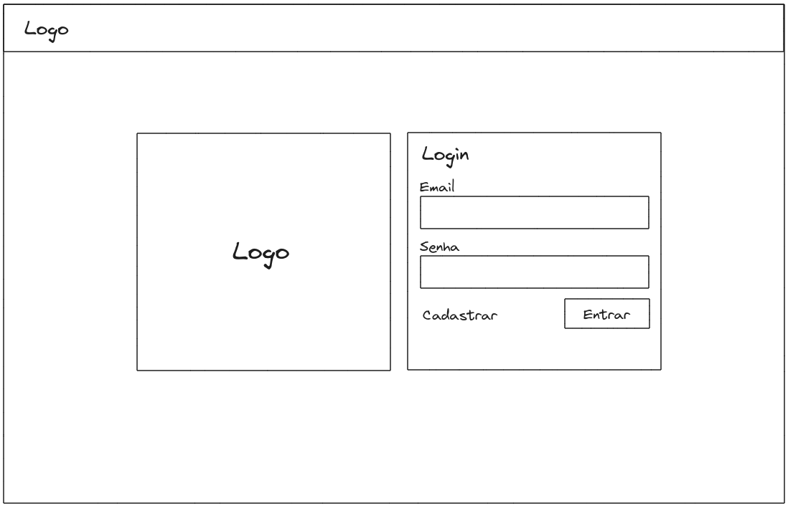
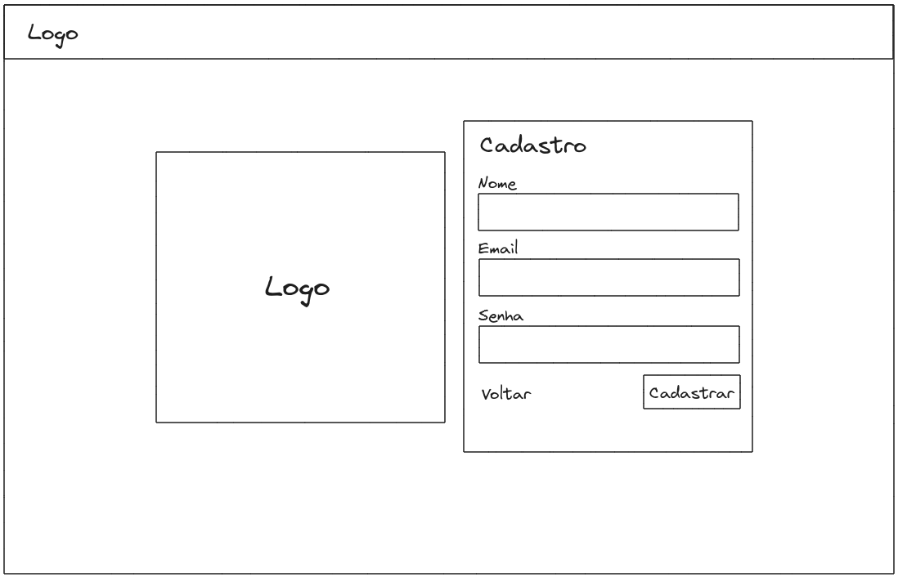
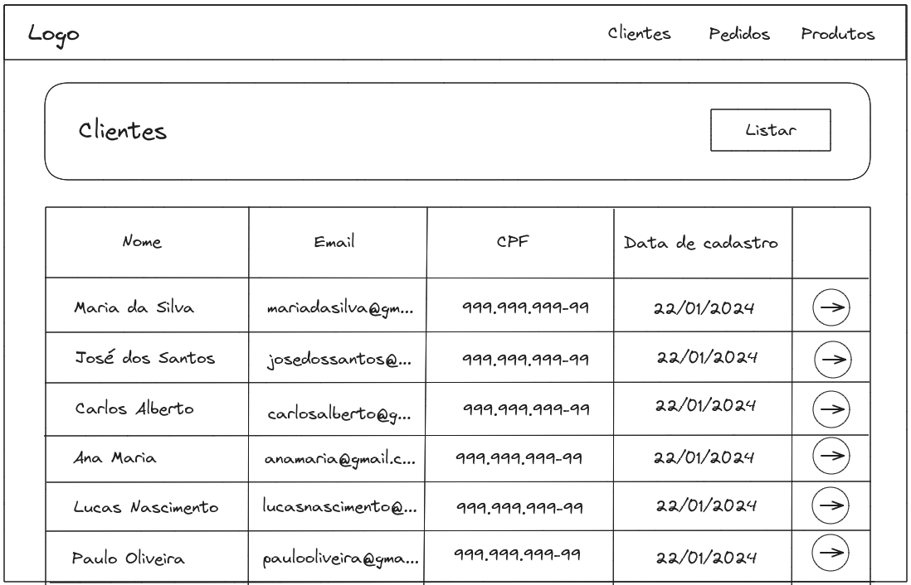
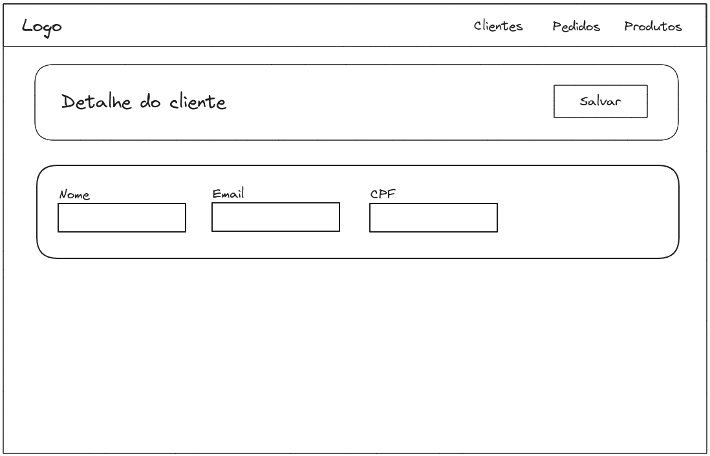

# Crosssystem Desafio Dev Front-end

## Introdução
Crie um sistema aonde o Usuário possa cadastrar, listar, editar e deletar clientes, pedidos e produtos com NextJS e React Native.

## Requisitos
1. O Usuário deve entrar em uma tela de Login e poder se cadastrar
2. Dentro do sistema o usuário poderá navegar entre 3 abas na barra de navegação:
   - Clientes
   - Pedidos
   - Produtos
3. Em cada tela ele poderá realizar as operações de CRUD
4. Todas as telas dentro do sistema deverão conter tela de listagem e tela de cadastro/edição
5. Todas as operações devem ser realizadas através das APIs criadas no NextJS

### Bônus
- Fazer conexão com o Banco de dados PostgreSQL
- Realizar as operações de CRUD salvando os dados no Banco de dados

### Observações
As APIs criadas no NextJS devem ser utilizadas para realizar as operações da aplicação web (NextJS) e mobile (React Native).

### Wireframes
#### Web - NextJS

#### Mobile - React Native

## Perguntas frequêntes
### Quais bibliotecas eu posso usar?
> Você pode utilizar qualquer uma. Porém é desejável a utilização das bibliotecas:
> #### NextJS
>  - PrimeReact
> #### React Native
>  - React Navigation ( Stack Navigator, Bottom Tabs Navigator )
>  - React Native Vector Icons
>  - React Native Async Storage
### Qual versão do NextJS devo utilizar?
> Da versão 13 para cima, utilizando a arquitetura App Router.
### Em quanto tempo eu posso fazer o desafio?
> Você deve completar no tempo previsto pela nossa Equipe aonde você foi indicado à fazer o desafio
### Acho a Interface feia, posso fazer uma do meu jeito?
> Sim, tendo em vista que a dificuldade de realizar a sua interface não será considerada. Dificuldades na criação da interface seguindo o Wireframe serão ouvidos.
### Preciso fazer o Deploy da minha aplicação em algum lugar?
> Não. As aplicações serão analisadas de forma local.
